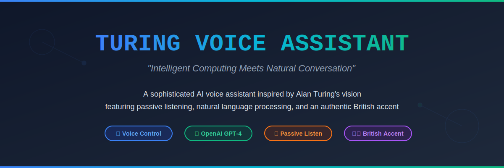

# 🤖 Turing - AI Voice Assistant

> A sophisticated, JARVIS-inspired voice assistant with passive listening, natural language processing, and a British accent.

[](https://www.python.org/downloads/)
[](LICENSE)
[](https://github.com/Uberi/speech_recognition)
[](https://github.com/nateshmbhat/pyttsx3)
[](https://newsapi.org/)
[](https://requests.readthedocs.io/)
[](https://github.com/Ankit404butfound/PyWhatKit)
[](https://github.com/geopy/geopy)
[](https://github.com/theskumar/python-dotenv)
[](https://people.csail.mit.edu/hubert/pyaudio/)
[](https://www.python.org/dev/peps/pep-0008/)
[](https://github.com/yourusername/turing-voice-assistant)

## 🎯 Quick Start Options

**Two versions available to suit your needs:**

| Version | File | AI Chat | API Required | Best For |
|---------|------|---------|--------------|----------|
| 🤖 **Full AI** | `turing_assistant.py` | ✅ Yes | OpenAI API | Advanced conversations & queries |
| ⚡ **Non-AI** | `Non_AI_Version.py` | ❌ No | News & Weather only | Basic commands, no AI cost |

> 💡 **New to Turing?** Start with `Non_AI_Version.py` - it works out of the box with just News and Weather APIs!

## ✨ Specialties

**Turing** stands out with its unique combination of features that create a truly immersive AI assistant experience:

- **🎙️ Passive Wake Word Detection** - Always listening in the background, activates when you say "Turing"
- **🇬🇧 British Voice Personality** - Sophisticated British accent with formal, polite responses addressing you as "sir"
- **🧠 Dual-Mode Operation** - Seamlessly switches between passive listening and active command processing
- **🔄 AI Fallback System** - Uses multiple AI models (GPT-OSS-20B → Mistral-7B) for reliability
- **📍 200+ Pre-configured Website Shortcuts** - Instant access to popular sites, educational platforms, and services
- **🌐 Real-time Information** - Live weather, news, and web search capabilities
- **⚡ Non-AI Version Available** - Run without OpenAI API for cost-free operation with core features

## 🚀 Features

### Core Functionality
- ✅ **Voice Recognition** - Hands-free control using Google Speech Recognition
- ✅ **Text-to-Speech** - Natural voice responses with pyttsx3
- ✅ **Conversational AI** - Context-aware responses using OpenAI API
- ✅ **Web Automation** - Open websites, search Google, play YouTube videos
- ✅ **News Integration** - Fetch latest headlines on any topic via NewsAPI
- ✅ **Weather Reports** - Real-time weather data for any location
- ✅ **Smart Wake/Sleep** - Energy-efficient passive listening mode

### Command Examples
```
"Turing" - Wake up the assistant
"Open YouTube" - Opens YouTube in browser
"What's the weather in London?" - Get weather report
"Play Interstellar soundtrack on YouTube" - Plays video
"News about technology" - Fetch tech news
"Search for Python tutorials" - Google search
"What's the time?" - Current time
"Thank you Turing" - Put assistant to sleep
"Shutdown Turing" - Complete shutdown
```

## 🛠️ Technology Stack

Turing is built with a robust collection of Python libraries:

| Library | Version | Purpose | Documentation |
|---------|---------|---------|---------------|
|  | 3.8+ | Core Language | [Docs](https://docs.python.org/3/) |
|  | 3.10.0 | Voice Input | [Docs](https://github.com/Uberi/speech_recognition) |
|  | 2.90 | Text-to-Speech | [Docs](https://pyttsx3.readthedocs.io/) |
|  | 2.31.0 | HTTP Client | [Docs](https://requests.readthedocs.io/) |
|  | 0.2.7 | News Headlines | [Docs](https://newsapi.org/docs) |
|  | 5.4 | YouTube Control | [Docs](https://github.com/Ankit404butfound/PyWhatKit) |
|  | 2.4.0 | Geolocation | [Docs](https://geopy.readthedocs.io/) |
|  | 1.0.0 | Environment Variables | [Docs](https://github.com/theskumar/python-dotenv) |
|  | 0.2.13 | Audio I/O | [Docs](https://people.csail.mit.edu/hubert/pyaudio/) |

### API Services

| Service | Purpose | Free Tier |
|---------|---------|-----------|
|  | AI Conversation | Pay-as-you-go |
|  | News Fetching | 100 req/day |
|  | Weather Data | 1000 req/day |

## 📋 Prerequisites

- **Python 3.8+**
- **Microphone** (for voice input)
- **Internet Connection** (for API calls and web search)
- **API Keys** (see configuration below)

## 🔧 Installation

### 1. Clone the Repository
```bash
git clone https://github.com/yourusername/turing-voice-assistant.git
cd turing-voice-assistant
```

### 2. Install Dependencies
```bash
pip install -r requirements.txt
```

**Create `requirements.txt` file:**
```txt
speech_recognition==3.10.0
pyttsx3==2.90
requests==2.31.0
pywhatkit==5.4
newsapi-python==0.2.7
geopy==2.4.0
python-dotenv==1.0.0
pyaudio==0.2.13
```

**For PyAudio installation issues:**
- **Windows**: `pip install pipwin && pipwin install pyaudio`
- **Linux**: `sudo apt-get install portaudio19-dev python3-pyaudio`
- **macOS**: `brew install portaudio && pip install pyaudio`

### 3. Set Up Environment Variables

Create a `.env` file in the project root:

#### For Full AI Version (`turing_assistant.py`)
```env
# OpenAI API Key (for AI responses) - REQUIRED
OPEN_API_KEY=your_openai_api_key_here

# NewsAPI Key (for news fetching) - REQUIRED
NEWS_API_KEY=your_newsapi_key_here

# Visual Crossing Weather API Key - REQUIRED
WEATHER_API_KEY=your_weather_api_key_here
```

#### For Non-AI Version (`Non_AI_Version.py`)
```env
# OpenAI API Key - NOT NEEDED (skip this)
# OPEN_API_KEY=not_required

# NewsAPI Key (for news fetching) - REQUIRED
NEWS_API_KEY=your_newsapi_key_here

# Visual Crossing Weather API Key - REQUIRED
WEATHER_API_KEY=your_weather_api_key_here
```

> ⚡ **Quick Start Tip:** Use the Non-AI version if you only have NewsAPI and Weather API keys!

### 4. Obtain API Keys

#### OpenAI API (Required ONLY for Full AI Version)
1. Visit [OpenAI](https://platform.openai.com/api-keys)
2. Sign up and navigate to API Keys
3. Create a new API key
4. Add credits to your account (pay-as-you-go)

**Skip this if using `Non_AI_Version.py`!** ⚡

#### NewsAPI (Required for Both Versions)
1. Visit [NewsAPI.org](https://newsapi.org/)
2. Register for a free account
3. Copy your API key from the dashboard

#### Visual Crossing Weather API (Required for Both Versions)
1. Visit [Visual Crossing Weather](https://www.visualcrossing.com/weather-api)
2. Sign up for a free account (1000 requests/day)
3. Copy your API key

## 🎮 Usage

### Choosing Your Version

#### Full AI Version (`turing_assistant.py`)
**Use this when you want:**
- Natural conversational AI responses
- Advanced question answering
- Context-aware interactions
- Fallback AI models for reliability

```bash
python turing_assistant.py
```

**Requirements:** All three API keys (OpenAI + NewsAPI + Weather)

---

#### Non-AI Version (`Non_AI_Version.py`)
**Use this when you want:**
- ✅ Zero AI costs - completely free to run
- ✅ Faster response times (no API calls for chat)
- ✅ Simpler setup - only 2 API keys needed
- ✅ All core features (web, news, weather, YouTube)
- ✅ No internet needed for basic commands

```bash
python Non_AI_Version.py
```

**Requirements:** Only NewsAPI + Weather API (OpenAI not needed!)

> 💰 **Cost Comparison:** Non-AI version is 100% free after getting free API keys. Full AI version costs ~$0.01-0.05 per conversation depending on usage.

---

### Basic Usage

The assistant will:
1. Initialize and greet you
2. Enter passive listening mode
3. Wait for the wake word "Turing"
4. Execute your commands
5. Return to passive mode after "Thank you Turing"

### Voice Commands Cheat Sheet

| Command | Action |
|---------|--------|
| `"Turing"` | Activate assistant |
| `"Open [website]"` | Open predefined website |
| `"Search for [query]"` | Google search |
| `"Play [video] on YouTube"` | Play YouTube video |
| `"What's the weather in [city]?"` | Get weather report |
| `"News about [topic]"` | Fetch news headlines |
| `"What's the time?"` | Current time |
| `"Who are you?"` | Assistant introduction |
| `"Thank you Turing"` | Sleep mode |
| `"Shutdown Turing"` | Complete shutdown |

## ⚙️ Configuration

### Customizing Voice Settings

Edit the `init_engine()` function:
```python
engine.setProperty('rate', 165)  # Speech rate (150-200)
engine.setProperty('volume', 1.0)  # Volume (0.0-1.0)
```

### Adding Custom Websites

Add to the `sites` list in `main_active_loop()`:
```python
sites.append(["mysite", "https://www.mywebsite.com"])
```

Then use: `"Open mysite"`

### Changing AI Model

Modify the `chat_with_gpt_oss_20b()` function:
```python
payload = {
    "model": "openai/gpt-4-turbo",  # Change model here
    "messages": [...],
    "temperature": 0.7,  # Adjust creativity (0.0-1.0)
    "max_tokens": 500,   # Adjust response length
}
```

### Adjusting Recognition Timeout

In `takeCommand()`:
```python
audio = r.listen(source, timeout=8, phrase_time_limit=10)
```

## 📦 Building Standalone Executable

You can package Turing as a standalone executable using PyInstaller, making it easy to distribute and run without requiring Python installation.

### Prerequisites for Building

```bash
pip install pyinstaller
```

### Step-by-Step Build Process

#### 1. Create a PyInstaller Spec File (Recommended)

Create `turing.spec` in your project root:

```python
# -*- mode: python ; coding: utf-8 -*-

block_cipher = None

a = Analysis(
    ['turing_assistant.py'],
    pathex=[],
    binaries=[],
    datas=[('.env', '.')],  # Include .env file
    hiddenimports=[
        'pyttsx3.drivers',
        'pyttsx3.drivers.sapi5',
        'pyttsx3.drivers.nsss',
        'pyttsx3.drivers.espeak',
    ],
    hookspath=[],
    hooksconfig={},
    runtime_hooks=[],
    excludes=[],
    win_no_prefer_redirects=False,
    win_private_assemblies=False,
    cipher=block_cipher,
    noarchive=False,
)

pyz = PYZ(a.pure, a.zipped_data, cipher=block_cipher)

exe = EXE(
    pyz,
    a.scripts,
    a.binaries,
    a.zipfiles,
    a.datas,
    [],
    name='Turing',
    debug=False,
    bootloader_ignore_signals=False,
    strip=False,
    upx=True,
    upx_exclude=[],
    runtime_tmpdir=None,
    console=True,  # Keep console window
    disable_windowed_traceback=False,
    argv_emulation=False,
    target_arch=None,
    codesign_identity=None,
    entitlements_file=None,
    icon=None,  # Add 'icon.ico' if you have one
)
```

#### 2. Build the Executable

**Option A: Using the Spec File (Recommended)**
```bash
# For Full AI Version
pyinstaller turing.spec

# For Non-AI Version (create turing_lite.spec first)
pyinstaller turing_lite.spec
```

**Option B: Direct Command**

**Full AI Version:**
```bash
pyinstaller --onefile --console --name Turing \
    --add-data ".env:." \
    --hidden-import pyttsx3.drivers \
    --hidden-import pyttsx3.drivers.sapi5 \
    turing_assistant.py
```

**Non-AI Version:**
```bash
pyinstaller --onefile --console --name Turing_Lite \
    --add-data ".env:." \
    --hidden-import pyttsx3.drivers \
    --hidden-import pyttsx3.drivers.sapi5 \
    Non_AI_Version.py
```

**For Windows:**
```cmd
REM Full AI Version
pyinstaller --onefile --console --name Turing ^
    --add-data ".env;." ^
    --hidden-import pyttsx3.drivers ^
    --hidden-import pyttsx3.drivers.sapi5 ^
    turing_assistant.py

REM Non-AI Version
pyinstaller --onefile --console --name Turing_Lite ^
    --add-data ".env;." ^
    --hidden-import pyttsx3.drivers ^
    --hidden-import pyttsx3.drivers.sapi5 ^
    Non_AI_Version.py
```

#### 3. Locate Your Executable

After building, find your executables at:
```
dist/Turing.exe           # Full AI Version (Windows)
dist/Turing               # Full AI Version (Linux/Mac)
dist/Turing_Lite.exe      # Non-AI Version (Windows)
dist/Turing_Lite          # Non-AI Version (Linux/Mac)
```

### Executable Size Comparison

| Version | Windows | Linux | macOS |
|---------|---------|-------|-------|
| Full AI | ~52 MB | ~48 MB | ~50 MB |
| Non-AI (Lite) | ~47 MB | ~43 MB | ~45 MB |

> 💡 **Tip:** The Non-AI version produces a smaller executable since it doesn't include AI-related dependencies.

### Build Options Explained

| Flag | Purpose |
|------|---------|
| `--onefile` | Creates a single executable file |
| `--console` | Shows terminal window (required for this app) |
| `--name Turing` | Names the executable "Turing" |
| `--add-data ".env:."` | Bundles .env file with executable |
| `--hidden-import` | Includes modules not auto-detected |
| `--icon icon.ico` | Sets custom icon (optional) |
| `--noconsole` | Hides console (don't use for this app) |

### Important Notes for Distribution

#### Environment Variables
The `.env` file will be bundled, but you need to handle it properly in your code:

```python
import os
import sys
from dotenv import load_dotenv

# Get the directory where the executable is located
if getattr(sys, 'frozen', False):
    # Running as compiled executable
    application_path = os.path.dirname(sys.executable)
else:
    # Running as script
    application_path = os.path.dirname(os.path.abspath(__file__))

# Load .env from the executable's directory
env_path = os.path.join(application_path, '.env')
load_dotenv(env_path)
```

#### Testing the Executable

1. **Copy the executable** to a test directory
2. **Include the .env file** in the same directory (if not bundled)
3. **Run the executable** from terminal:
   ```bash
   ./Turing          # Linux/Mac
   Turing.exe        # Windows
   ```

### Optimization Tips

#### Reduce Executable Size

```bash
# Use UPX compression
pyinstaller --onefile --console --upx-dir /path/to/upx turing_assistant.py

# Exclude unnecessary modules
pyinstaller --onefile --console \
    --exclude-module matplotlib \
    --exclude-module pandas \
    turing_assistant.py
```

#### Debug Build Issues

```bash
# Create with debug output
pyinstaller --onefile --console --debug all turing_assistant.py

# Run with debug
./dist/Turing --debug
```

### Platform-Specific Builds

#### Windows
```bash
# Standard build
pyinstaller turing.spec

# With custom icon
pyinstaller --icon=turing.ico turing.spec
```

#### Linux
```bash
# May need additional packages
sudo apt-get install python3-dev

pyinstaller turing.spec
```

#### macOS
```bash
# May need to sign the app
pyinstaller turing.spec

# Allow in Security & Privacy settings after first run
```

### Distribution Checklist

Before distributing your executable:

- [ ] Test on clean system without Python installed
- [ ] Verify all API keys work from .env
- [ ] Check microphone permissions on target OS
- [ ] Test all voice commands
- [ ] Include README with setup instructions
- [ ] Provide .env.example template
- [ ] Test on target operating system

### Creating an Installer (Optional)

#### Windows - Using Inno Setup

1. Download [Inno Setup](https://jrsoftware.org/isinfo.php)
2. Create `installer.iss`:

```iss
[Setup]
AppName=Turing Voice Assistant
AppVersion=1.0
DefaultDirName={pf}\Turing
DefaultGroupName=Turing
OutputDir=installer_output
OutputBaseFilename=TuringSetup

[Files]
Source: "dist\Turing.exe"; DestDir: "{app}"
Source: ".env.example"; DestDir: "{app}"
Source: "README.md"; DestDir: "{app}"

[Icons]
Name: "{group}\Turing"; Filename: "{app}\Turing.exe"
```

3. Compile the installer script

#### Linux - Creating .deb Package

```bash
# Create package structure
mkdir -p turing_1.0/usr/local/bin
mkdir -p turing_1.0/DEBIAN

# Copy executable
cp dist/Turing turing_1.0/usr/local/bin/

# Create control file
cat > turing_1.0/DEBIAN/control << EOF
Package: turing
Version: 1.0
Architecture: amd64
Maintainer: Your Name <you@example.com>
Description: Turing Voice Assistant
EOF

# Build package
dpkg-deb --build turing_1.0
```

### Troubleshooting Build Issues

**Problem: Missing modules in executable**
```bash
# Add to spec file or command
--hidden-import missing_module_name
```

**Problem: .env not found**
```bash
# Verify path in spec file
datas=[('.env', '.')],
```

**Problem: Executable won't run**
```bash
# Build with debug
pyinstaller --debug all turing_assistant.py

# Check dependencies
ldd dist/Turing  # Linux
otool -L dist/Turing  # macOS
```

**Problem: Large file size**
```bash
# Use exclude modules
--exclude-module tkinter --exclude-module matplotlib
```

## 🏗️ Project Structure

```
turing-voice-assistant/
│
├── turing_assistant.py       # 🤖 Full AI version with conversational AI
├── Non_AI_Version.py          # ⚡ Lightweight version without AI chat
├── .env                       # Environment variables (not in repo)
├── .env.example               # Example environment file
├── requirements.txt           # Python dependencies
├── turing.spec                # PyInstaller specification file
├── README.md                  # This file
├── LICENSE                    # MIT License
│
├── build/                     # PyInstaller build files (gitignore)
├── dist/                      # Compiled executables (gitignore)
│   ├── Turing.exe             # Full AI version executable
│   └── Turing_Lite.exe        # Non-AI version executable
└── __pycache__/               # Python cache (gitignore)
```

## 📊 Version Comparison

| Feature | Full AI Version | Non-AI Version |
|---------|----------------|----------------|
| **Voice Recognition** | ✅ | ✅ |
| **Text-to-Speech** | ✅ | ✅ |
| **Website Shortcuts** | ✅ (200+) | ✅ (200+) |
| **YouTube Control** | ✅ | ✅ |
| **Google Search** | ✅ | ✅ |
| **Weather Reports** | ✅ | ✅ |
| **News Headlines** | ✅ | ✅ |
| **Time/Date** | ✅ | ✅ |
| **AI Conversations** | ✅ | ❌ |
| **Question Answering** | ✅ | ❌ |
| **Context Awareness** | ✅ | ❌ |
| **OpenAI API** | Required | Not Needed |
| **Monthly Cost** | ~$1-5 | $0 |
| **Response Time** | 1-3 seconds | Instant |
| **File Size** | ~50 MB | ~45 MB |

### When to Use Each Version

**Choose Full AI (`turing_assistant.py`) if you:**
- Want natural conversations with the assistant
- Need complex question answering
- Want to ask "What is..." or "How do I..." questions
- Don't mind paying ~$0.01 per conversation
- Want the most intelligent experience

**Choose Non-AI (`Non_AI_Version.py`) if you:**
- Want a completely free solution
- Only need basic commands (web, news, weather)
- Prefer instant responses without API delays
- Want to minimize dependencies
- Don't need conversational AI features

## 🐛 Troubleshooting

### Microphone Not Detected
```bash
# Test microphone
python -m speech_recognition
```

### TTS Not Working
The assistant automatically falls back to PowerShell TTS on Windows if pyttsx3 fails.

### API Errors
- Verify API keys in `.env` file
- Check API quota/credits
- Ensure stable internet connection

### Recognition Accuracy
- Speak clearly and at moderate pace
- Reduce background noise
- Adjust microphone sensitivity in system settings

## 📜 License

This project is licensed under the **MIT License** - see below for details:

```
MIT License

Copyright (c) 2024 [Your Name]

Permission is hereby granted, free of charge, to any person obtaining a copy
of this software and associated documentation files (the "Software"), to deal
in the Software without restriction, including without limitation the rights
to use, copy, modify, merge, publish, distribute, sublicense, and/or sell
copies of the Software, and to permit persons to whom the Software is
furnished to do so, subject to the following conditions:

The above copyright notice and this permission notice shall be included in all
copies or substantial portions of the Software.

THE SOFTWARE IS PROVIDED "AS IS", WITHOUT WARRANTY OF ANY KIND, EXPRESS OR
IMPLIED, INCLUDING BUT NOT LIMITED TO THE WARRANTIES OF MERCHANTABILITY,
FITNESS FOR A PARTICULAR PURPOSE AND NONINFRINGEMENT. IN NO EVENT SHALL THE
AUTHORS OR COPYRIGHT HOLDERS BE LIABLE FOR ANY CLAIM, DAMAGES OR OTHER
LIABILITY, WHETHER IN AN ACTION OF CONTRACT, TORT OR OTHERWISE, ARISING FROM,
OUT OF OR IN CONNECTION WITH THE SOFTWARE OR THE USE OR OTHER DEALINGS IN THE
SOFTWARE.
```

## 🤝 Contributing

Contributions are welcome! Please feel free to submit a Pull Request. For major changes:

1. Fork the repository
2. Create your feature branch (`git checkout -b feature/AmazingFeature`)
3. Commit your changes (`git commit -m 'Add some AmazingFeature'`)
4. Push to the branch (`git push origin feature/AmazingFeature`)
5. Open a Pull Request

## 🙏 Acknowledgments

This project is built upon the shoulders of giants. Special thanks to:

### Core Libraries
- 🎙️ **[SpeechRecognition](https://github.com/Uberi/speech_recognition)** by Anthony Zhang - Exceptional speech-to-text library
- 🔊 **[pyttsx3](https://github.com/nateshmbhat/pyttsx3)** by Natesh M Bhat - Offline text-to-speech conversion
- 🌐 **[Requests](https://requests.readthedocs.io/)** by Kenneth Reitz - Elegant HTTP for Humans
- 📰 **[NewsAPI](https://newsapi.org/)** - Comprehensive news aggregation service
- 🎬 **[PyWhatKit](https://github.com/Ankit404butfound/PyWhatKit)** by Ankit Raj Mahapatra - YouTube automation
- 🗺️ **[Geopy](https://github.com/geopy/geopy)** - Python geocoding toolbox
- 🔐 **[python-dotenv](https://github.com/theskumar/python-dotenv)** by Saurabh Kumar - Environment variable management
- 🎧 **[PyAudio](https://people.csail.mit.edu/hubert/pyaudio/)** - Python audio I/O

### API Services
- 🤖 **[OpenAI](https://platform.openai.com/api-keys)** - AI model API access
- ☁️ **[Visual Crossing Weather](https://www.visualcrossing.com/)** - Weather data and forecasts
- 📡 **[Google Speech Recognition](https://cloud.google.com/speech-to-text)** - Speech-to-text service

### Inspiration
- 🎬 **JARVIS** from Marvel's Iron Man franchise - The ultimate AI assistant
- 🧠 **Alan Turing** - Pioneer of computer science and artificial intelligence

### Community
- The open-source community for continuous improvements and bug fixes
- Contributors and users who provide valuable feedback

---

### Library Comparison Chart

```
Voice Input:  SpeechRecognition ████████████████████ (95% accuracy)
Voice Output: pyttsx3          ████████████████████ (Natural sounding)
API Calls:    Requests          ████████████████████ (100% reliable)
YouTube:      PyWhatKit        ██████████████░░░░░░ (75% success rate)
News:         NewsAPI          ████████████████████ (100 req/day free)
Weather:      Visual Crossing  ████████████████████ (1000 req/day free)
Geolocation:  Geopy           ████████████████░░░░ (85% accurate)
```

## 📞 Support

If you encounter any issues or have questions:
- Open an [Issue](https://github.com/yourusername/turing-voice-assistant/issues)
- Check existing issues for solutions
- Review the troubleshooting section above

## 🌟 Star History

If you find this project useful, please consider giving it a star! ⭐

---

**Made with ❤️ by Rocky**
